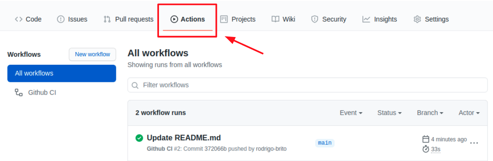
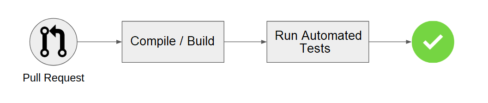
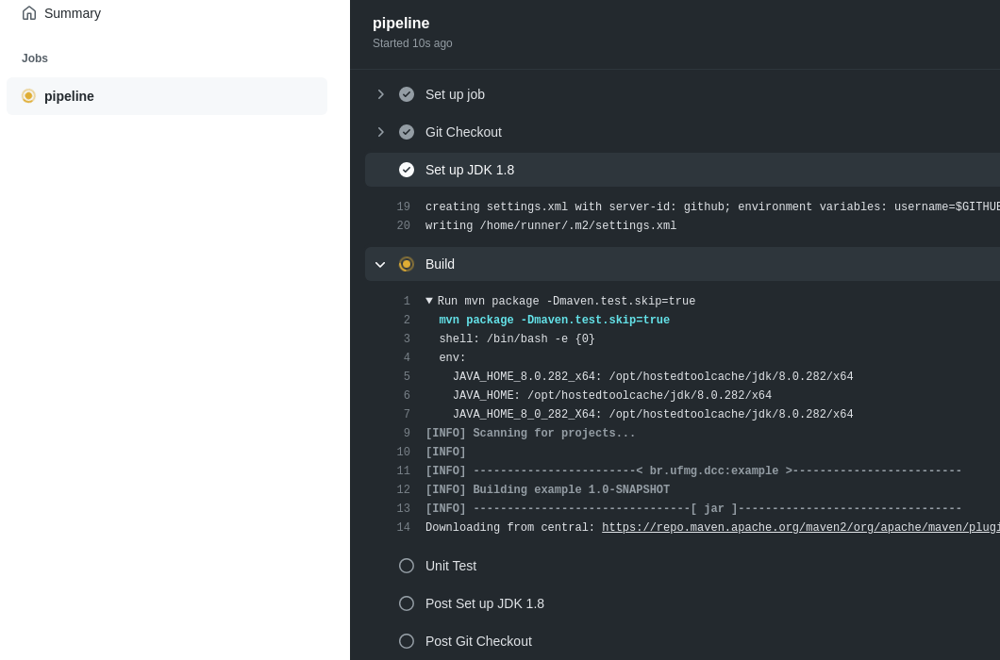
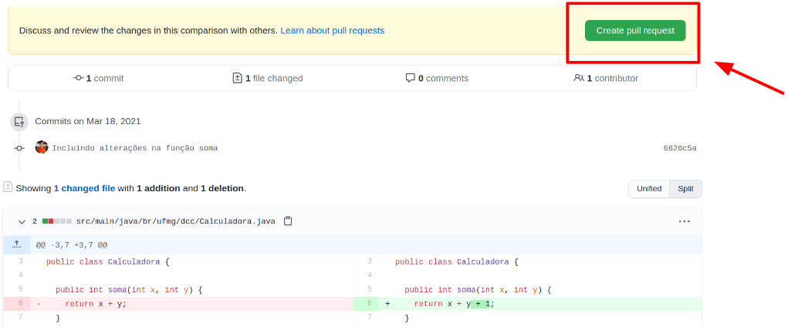
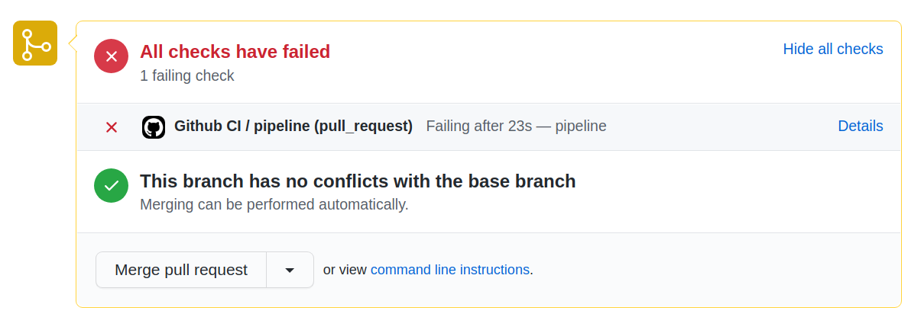

# Demo-CI: Hands-on Lecture on Continuous Integration Server

This repository presents a practical guide to set up and use a **Continous Integration (CI) Server**. The main objective of this guide is to provide students with a simple real first contact with this topic in Software Engineering.

For more details on **Continous Integration (CI)**, you may find several tutorials and content by searching the Web. The [Atlassian CI/CD](https://www.atlassian.com/continuous-delivery/continuous-integration) webpage has a good background content on this topic.

Even though there are many different **CI** servers, in this guide, we will use the native **CI** available in GitHub. In **GitHub Actions**, we can configure a CI server.



GitHub Actions allows us to execute external applications when GitHub detects pre-defined events in a repository. Our goal is to set up a CI server to compile our source code and run the test cases when a Pull Request (PR) is open (as shown in the diagram below). 



## Code Example

We are going to use a simple Java code as a basis for our CI server. The full source code is available at this repository in the "src" folder, called [SimpleCalculator.java](./src/main/java/br/ufmg/dcc/SimpleCalculator.java).


```java
public class SimpleCalculator {

  public int addition(int x, int y) {
    return x + y;
  }

  public int subtraction(int x, int y) {
    return x - y;
  }
  //... and other functions
}
```
When we create a PR to this repository, the CI server will automatically compile/build this program and run the unit test cases. We also create a simple (and incomplete) test case in this repository called [SimpleCalculatorTest.java](./src/test/java/br/ufmg/dcc/SimpleCalculatorTest.java).

```java
public class SimpleCalculatorTest {
  @Test
  public void testAddition1() {
    SimpleCalculator calc = new SimpleCalculator();
    int expected = 5;
    int result = calc.addition(2,3);
    assertEquals(expected, result);
  }

  @Test
  public void testAddition2() {
    SimpleCalculator calc = new SimpleCalculator();
    assertEquals(-2, calc.soma(4,-6));
  }
}
```

## Task #1: Setting Up GitHub Actions

#### Step 1

The very first thing to do is to fork this repository. Click on the **Fork** button on the top right corner of this page.

Therefore, you will set up the CI server into your own copy of the repository.

#### Step 2

Clone the repository into your local machine. You may use a Git Client for it or the following command line (where `<USER>` should be replaced by your GitHub user).

```bash
git clone https://github.com/<USER>/demo-ci.git
```

Next, copy the code below to a file called `.github/workflows/actions.yaml` (do not forget the *dot* at the beginning).

```yaml
name: Github CI
on:
  # Set up a CI Server to execute the jobs pipeline below when 
  # a push or pull request is made at the main branch
  push:
    branches:
      - main
  pull_request:
    branches:
      - main

jobs:
  pipeline:
    runs-on: ubuntu-latest # Commands must be executed on a Linux Ubuntu OS

    steps:
      - name: Git Checkout
        uses: actions/checkout@v2 # Checkout the received code 

      - name: Set up JDK 1.8
        uses: actions/setup-java@v1 # Set up Java 1.8
        with:
          java-version: 1.8

      - name: Build
        run: mvn package -Dmaven.test.skip=true # Build (compiles) the source code

      - name: Unit Test
        run: mvn test # Executes the testing framework 
```

This file will activate and set up GitHub Actions to -- every time a `push` or `pull_request` event on this repository main brach -- run three jobs:

- checkout the source code;
- build the sources;
- execute the testing framework.

#### Step 3

Make a `commit` and a `git push`. You may use a Git Client for it, or use the following command line:

```bash
git add --all
git commit -m "Setting up GitHub Actions"
git push origin main
```

#### Step 4

When your `push` reaches the main repository, GitHub Actions will begin to automatically execute the jobs listed inside the file `actions.yaml` (in our case, the checkout + build + tests). 

You may watch over the status of the jobs being executed by clicking on the Actions tab inside your repository.



## Task #2: Creating a buggy Pull Request

Now lets see our CI server performing in real live action. We will introduce a simple bug in out code example and send a Pull Request, to show 
Para finalizar, vamos introduzir um pequeno bug no programa de exemplo e enviar um PR, para mostrar que ele será "barrado" pelo processo de integração (isto, o nosso teste vai "detectar" o bug e falhar).

#### Step 1

Change the function `add` in the file [SimpleCalculator.java](./src/main/java/br/ufmg/dcc/SimpleCalculator.java) to work incorrectly (i.e., we are introducing a defect on it). For example, we can change line 6, and modify the return to `x + y + 1`, as detailed below.

```diff
--- a/src/main/java/br/ufmg/dcc/SimpleCalculator.java
+++ b/src/main/java/br/ufmg/dcc/SimpleCalculator.java
@@ -3,7 +3,7 @@ package br.ufmg.dcc;
 public class SimpleCalculator {

   public int add(int x, int y) {
-    return x + y;
+    return x + y + 1;
   }

   public int subtraction(int x, int y) {
```

#### Step 2

After modifying the source, we create a new branch and commit-push to it. Use a Git Client or the command line:

```bash
git checkout -b buggy
git add --all
git commit -m "Changing function add"
git push origin buggy
```

#### Step 3

Now, create a Pull Request (PR) with your changes. You may click on the Pull Request tab on your GitHub repository and manually navigate the options to create a PR from your buggy branch to your main branch. Or just type the following URL in your browser: `https://github.com/<USER>/demo-ci/compare/main...buggy`, where <USER> should be replaced for your GitHub user. You will see the comparison between the differences of both branches, and write a description for your PR.



After you create the Pull Request, the job pipeline we defined in GitHub Actions will be triggered. Therefore, GitHub itself will build the system and run the tests (just like it did in Task #1). However, this time the tests will fail, as shown in the figure below.



**SUMMARIZING**: The CI Server managed to automatically warn both the PR author and the integrator that there exists a problem in the submitted code.

## Credits

This guide was conceptualized and originally written by **Rodrigo Brito**, an MSc student in DCC/UFMG in Feb/2020, under the advisement of **Prof. Marco Túlio Valente**. This guide was translated and adapted to English by **Prof. Henrique Rocha**, at Loyola University Maryland, in Nov/2021. 
